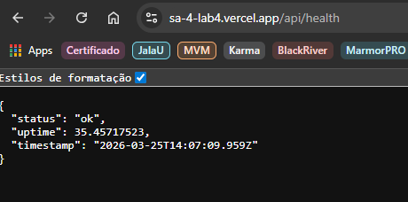
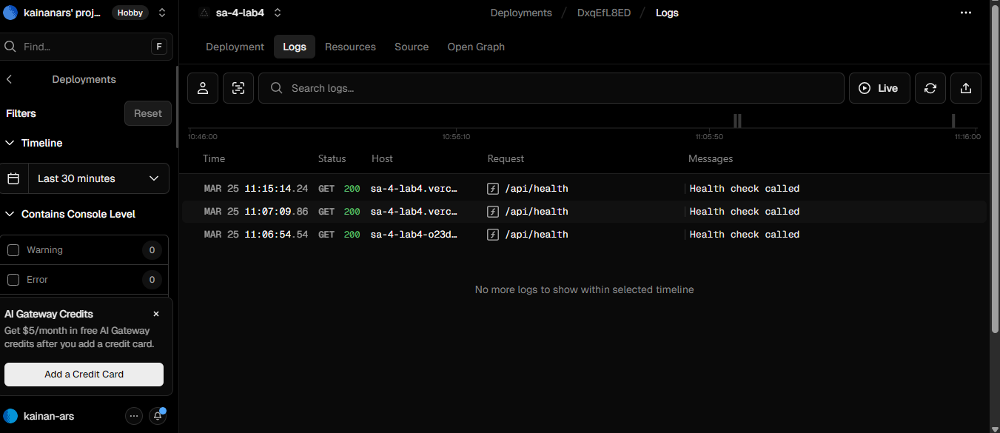

# LAB4 - 12Fatores

Este repositório é a entrega do Lab 4. A proposta foi montar um serviço HTTP pequeno, mas já com práticas de Doze‑Fatores desde o começo.

## Resumo do projeto

- Repositório: https://github.com/Kainanars/SA4-lab4
- Linguagem: JavaScript
- Framework: Express
- Deploy: Vercel

Estrutura principal:

```text
lab4/
├── api/
│   └── health.js
├── scripts/
│   └── dev.js
├── docs/
├── .env.example
├── .gitignore
├── LICENSE
├── package.json
└── README.md
```

Commit da entrega: rodar `git rev-parse --short HEAD` antes de enviar.

## Como rodar localmente

```bash
git clone https://github.com/Kainanars/SA4-lab4.git
cd lab4
npm install
cp .env.example .env
npm run dev
```

Teste do endpoint:

```bash
curl http://localhost:3000/api/health
```

Exemplo de resposta:

```json
{
  "status": "ok",
  "uptime": 31.5439309,
  "app": "lab4-service",
  "timestamp": "2026-03-25T16:49:04.502Z"
}
```

Deploy publicado:

- https://sa-4-lab4.vercel.app/api/health

Evidências:

- 
- 

## Mapeamento dos fatores

| Fator                  | Implementação                                          | Evidência                           |
| ---------------------- | ------------------------------------------------------ | ----------------------------------- |
| I. Codebase            | Repositório único versionado                           | GitHub                              |
| II. Dependencies       | Dependências declaradas explicitamente                 | package.json                        |
| III. Config            | Configuração por variáveis de ambiente                 | .env.example                        |
| IV. Backing Services   | Serviço externo definido por env                       | BACKING_SERVICE_URL em .env.example |
| V. Build, Release, Run | Scripts separados para executar local e release/deploy | package.json                        |
| VI. Processes          | Processo sem estado de sessão                          | api/health.js                       |
| VII. Port Binding      | Porta lida de PORT                                     | scripts/dev.js                      |
| VIII. Concurrency      | Escala por instâncias serverless                       | Vercel                              |
| IX. Disposability      | Shutdown gracefull para sinais                         | scripts/dev.js                      |
| X. Dev/Prod Parity     | Mesmo código, variando por env                         | api/health.js e scripts/dev.js      |
| XI. Logs               | Logs estruturados no stdout                            | api/health.js e scripts/dev.js      |
| XII. Admin Processes   | Processo administrativo one-off                        | npm run test                        |

Observação:

- Não deixamos praticamente nenhum fator fora do escopo. Alguns pontos (como concorrência) são resolvidos pela infraestrutura do Vercel.

## Scripts e variáveis de ambiente

Scripts principais:

- `npm run dev`
- `npm run start`
- `npm run test`

Variáveis em `.env.example`:

- `PORT`
- `NODE_ENV`
- `APP_NAME`
- `BACKING_SERVICE_URL`

## Colaboração com IA e reflexão

Prompts que mais ajudaram:

- Como criar uma API simples com um enpoint /health
- Preciso adaptar esse projeto para arquiteura serverless com deploy na Vercel
- Vou aplicar os Doze-Fatores nesse projeto, como garanto cada um dos fatores?
- Como adicionar graceful shutdown

Decisões que fiz durante as iterações:

- Começamos com o Express tradicional e adaptamos para serverless por conta da infraestrutura do Vercel.
- Separamos a execução local em (`scripts/dev.js`) e a de produção em (`api/health.js`).
- Padronizamos os logs em JSON para facilitar leitura e evidência.

Reflexão final:

A IA ajudou bastante a acelerar o scaffold, mas os ajustes que fizemos fez diferença para acompanhar os 12 fatores com clareza. O principal aprendizado foi traduzir os fatores para evidências concretas em código e execução. A estrutura do projeto ficou simples, mas já com boas práticas para escalar e manter. O deploy na Vercel facilitou a parte de concorrência e infraestrutura, permitindo focar mais na aplicação em si.
